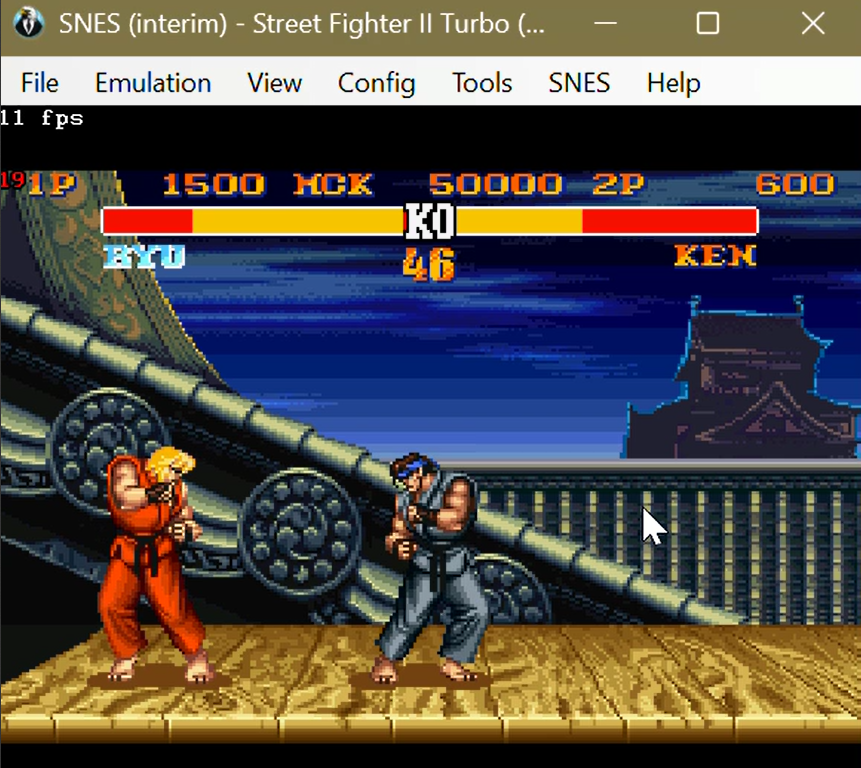
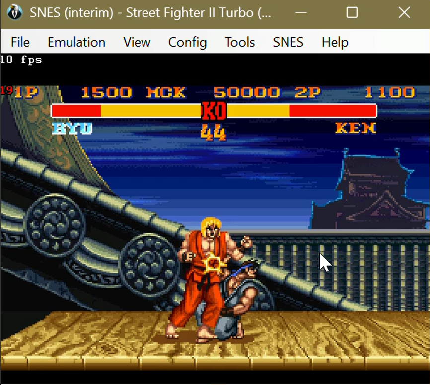
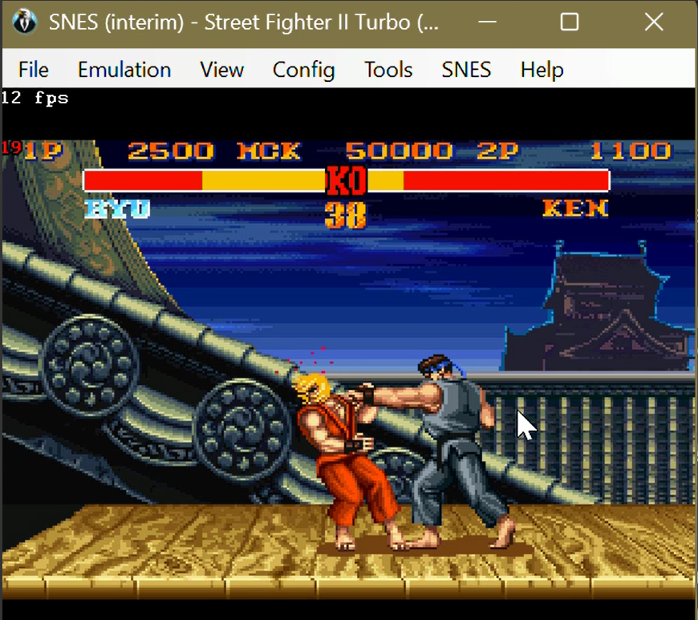
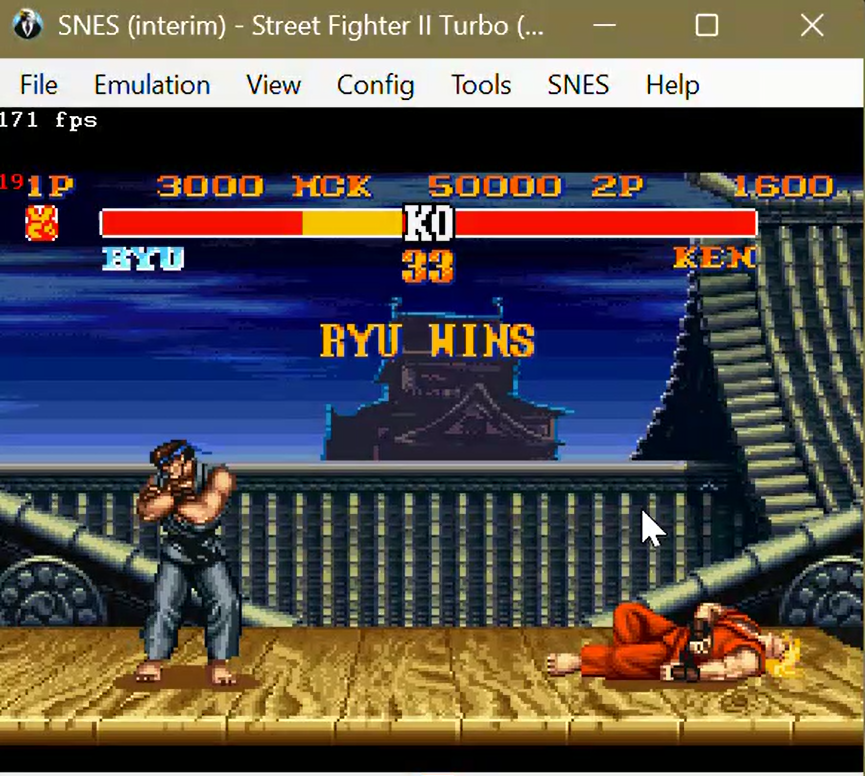

# **Street-Fighter-AI-Bot**

## **Team Members**
- 23i-0003 - Safee Ahmed Bangash
- 23i-0015 - Ahmed Izaan
- 23i-0081 - Hamd-Ul-Haq
- 23i-2558 - Mohammad Haider Abbas

## **Table of Contents**

- [Project Description](#-project-description)
- [Requirements](#️-requirements)
  - [Operating System](#-operating-system)
  - [Python API](#-python)
  - [Bizhawk emulator](#-python-packages)
- [Setup Instructions](#-setup-instructions)
- [How to Run](#-how-to-run)
  - [Emulator Setup](#-emulator-setup)
  - [Run Your Bot](#️-run-your-bot)
  - [ Run Two Bots (Bot vs Bot)](#-run-two-bots-bot-vs-bot)
- [AI Logic](#-ai-logic)
  - [Dataset Generation](#-dataset-generation)
  - [Model Training](#-model-training)
  - [Fight Function](#-fight-function)
- [Dataset Format](#-dataset-format)
- [Gameplay Images](#-gameplay-images)

## **Project Description**

In this project we developed an AI bot, that plays Street Fighter 2 Turbo on the BizHawk emulator. The bot uses machine learning to make decisions during gameplay, the goal was to develop an AI bot that could play against any selected fighter and adapt to different scenarios.

## **Requirements**

- Operating System: 
    - Windows 7 or above (64-bit).
- Python API:
    - Made in version 3.6.3. 
    - Version 3 and greater compaitable.
    - Libraries: pandas, tensorflow, scikit learn.
- BizHawk emulator.

## **Setup Instructions**

Download the official API from the given link:
https://drive.google.com/file/d/18SN8e_XqJFEPZ0wcWXQ8GnzuZk58cn-2/view

Then extract it to your desired directory.

## **How to Run**
    
- Emulator Setup:
    - Run EmuHawk.exe.
    - Go to File > Open ROM and select Street Fighter II Turbo (U).smc.
    - Go to Tools > Tool Box (or press Shift+T).
    - Keep both the emulator window and tool box open.
- Run Your Bot:
    - Open a terminal inside your project directory and run: 
        - python controller.py 1, 1 for player 1 (left) and 2 for player 2 (right).
    - After running the bot:
        - Select a character in the emulator (Normal Mode).
        - Click the Gyroscope Bot icon in the toolbar.
        - If connection is successful, you’ll see:
            - Connected to game! or CONNECTED SUCCESSFULLY and a timer (modifiable in controller.py script, it indicates how long the connection will last).
- Run Two Bots (Bot vs Bot):
    - Open two terminals and run:
        - python controller.py 1
        - python controller.py 2
    - Select VS Battle Mode in the emulator.
    - Select two players manually.
    - Start the match.

## **AI Logic**

- Dataset Generation:
    - Manually play the game and capture game state/actions in real time.
    - Save in .csv file.
- Model Training:
    - Use Machine Learning to predict actions based on game state.
    - Save the trained model.
- Fight Function
    - Modify the fight() function in bot.py.

## **Dataset Format**

Sample CSV columns: timer,p1_id,p1_health,p1_x,p1_y,p1_jumping,p1_crouching,p1_in_move,p1_move_id,p2_id,p2_health,p2_x,p2_y,p2_jumping,p2_crouching,p2_in_move,p2_move_id,p1_rel_x,p1_rel_y,p1_facing_opponent,p1_health_diff,act_B,act_Y,act_X,act_A,act_L,act_R,act_Up,act_Down,act_Left,act_Right,act_Select,act_Start

## **Gameplay Images**
 

 

 

 

